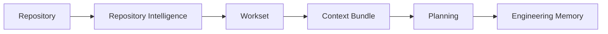
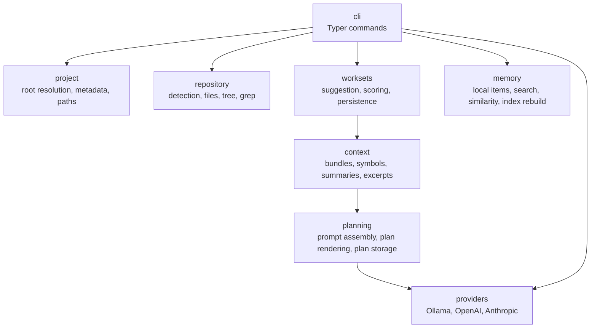

# Forge

**AI-native Software Engineering Workbench**

Repository Intelligence | Architecture Awareness | Engineering Memory | Planning

[](https://www.python.org/)
[](#command-reference)
[](pyproject.toml)
[](#roadmap)

Forge is a local-first engineering workbench for understanding repositories, building precise task context, and generating implementation plans with your preferred AI model. It combines deterministic repository analysis with provider-independent model access so engineers and AI agents can work from the same project facts.

| Area | Support |
| --- | --- |
| Providers | Ollama, OpenAI, Anthropic |
| Platforms | macOS and Linux with Python 3.12+; Windows is not yet verified |
| Interface | `forge` CLI |
| Project state | Local `.forge/` directory inside each repository |
| Global config | `~/.forge/config.yaml` |

## Why Forge?

Forge is not just another AI CLI. It focuses on the engineering context that must exist before a model is useful.

| Differentiator | What it means |
| --- | --- |
| Deterministic repository intelligence | Repository detection, file search, trees, and workset suggestions run without model calls. |
| Worksets | Task-scoped file sets make context explicit, reviewable, and repeatable. |
| Context engineering | Forge turns a workset into a structured bundle with symbols, summaries, dependency hints, and excerpts. |
| Architecture-aware planning | Plans are generated from repository facts and selected context, not from a blind prompt. |
| Engineering memory | Local memory commands let teams search and relate prior decisions, plans, and task context. |
| Provider independence | Ollama, OpenAI, and Anthropic use the same provider interface. |

## Key Features

| Capability | Status | Description |
| --- | --- | --- |
| Project initialization | Available | Creates project metadata and local Forge artifact directories. |
| Repository detection | Available | Detects languages, build systems, package managers, frameworks, roots, and important files. |
| Repository search | Available | Lists files, prints compact trees, and searches repository content while skipping generated/vendor paths. |
| Workset suggestion | Available | Scores relevant files for a task using deterministic filename, path, and content signals. |
| Workset management | Available | Creates, lists, shows, refreshes, edits, and clears persisted worksets. |
| Context bundles | Available | Generates Markdown or JSON context from a workset without calling a model. |
| Planning | Available | Generates advisory implementation plans from a task and workset using the configured model. |
| Model management | Available | Lists configured provider models and persists a default model. |
| Engineering memory search | Available | Lists, shows, searches, relates, and rebuilds local memory items. |
| Patch generation | Planned | Not implemented. Forge does not apply code changes from plans today. |
| Test orchestration | Planned | Not implemented as a first-class `forge verify` command today. |

## Installation

### Python

Forge currently installs from source.

```bash
git clone <forge-repository-url>
cd forge
python3.12 -m venv .venv
source .venv/bin/activate
pip install -e ".[dev]"
```

### Ollama

Ollama is the default provider.

```bash
brew install ollama
ollama serve
ollama pull llama3.1:8b
```

On Linux, install Ollama from the official Ollama installer, then run the same `ollama serve` and `ollama pull` commands.

### Optional Providers

OpenAI and Anthropic require API keys in the environment and provider settings in `~/.forge/config.yaml`.

```bash
export OPENAI_API_KEY=...
export ANTHROPIC_API_KEY=...
forge config edit
```

Example OpenAI configuration:

```yaml
provider: openai
default_model: gpt-4.1-mini
providers:
  openai:
    endpoint: https://api.openai.com/v1
    timeout_seconds: 120
```

Example Anthropic configuration:

```yaml
provider: anthropic
default_model: claude-3-5-sonnet-latest
providers:
  anthropic:
    endpoint: https://api.anthropic.com/v1
    timeout_seconds: 120
```

### Verification

```bash
forge version
forge doctor
forge models
pytest
```

## Five-Minute Quick Start

Run these commands from the repository you want Forge to inspect.

```bash
forge doctor
forge init
forge project info
forge repo detect
forge workset suggest "authentication"
forge workset create auth --query "authentication"
forge workset context auth
forge plan "Add GitHub OAuth" --workset auth
```

| Command | What it does |
| --- | --- |
| `forge doctor` | Checks local tools and provider configuration. |
| `forge init` | Creates `.forge/project.json` and project artifact directories. |
| `forge project info` | Shows repository identity, initialization state, and detected metadata. |
| `forge repo detect` | Reports repository languages, build systems, frameworks, roots, and important files. |
| `forge workset suggest "authentication"` | Ranks files likely to matter for the task. |
| `forge workset create auth --query "authentication"` | Persists the suggested files as `.forge/worksets/auth.json`. |
| `forge workset context auth` | Writes a deterministic context bundle under `.forge/context/`. |
| `forge plan "Add GitHub OAuth" --workset auth` | Calls the configured model to produce an advisory implementation plan. |

## Typical Workflow



1. Inspect the repository with deterministic commands.
2. Create a workset for the task.
3. Generate a context bundle that can be reviewed or shared.
4. Ask Forge to plan against that explicit context.
5. Store or search engineering memory as the project evolves.

## Core Concepts

### Repository

A repository is the source tree Forge inspects. By default, Forge walks upward from the current directory until it finds `.git`. If no `.git` directory exists, Forge uses the current directory. Most commands also accept `--root <path>` to override this behavior.

### Project

A project is a repository initialized for Forge. `forge init` creates `.forge/project.json` with project identity, detected metadata, timestamps, and the Forge version that wrote it.

### Workset

A workset is a named, task-scoped set of files. Forge can suggest worksets from a query, then persist them under `.forge/worksets/`. Worksets are editable with `add`, `remove`, `refresh`, and `clear`.

### Context Bundle

A context bundle is a deterministic Markdown or JSON artifact generated from a workset. It includes file statistics, summaries, symbols, dependency hints, and relevant excerpts. Context bundles do not call AI models.

### Plan

A plan is an advisory implementation plan generated by the configured model from a task and workset context. Plans can be printed or saved under `.forge/plans/`. Forge plans do not modify files.

### Engineering Memory

Engineering memory is local project knowledge stored under `.forge/memory/`. Current commands can list, show, search, relate, and rebuild memory items. Memory helps future work discover prior decisions and task context.

## Command Reference

### Project

| Command | Purpose |
| --- | --- |
| `forge init` | Initialize Forge metadata in the current repository. |
| `forge init --force` | Reinitialize project metadata while preserving creation history. |
| `forge project root` | Print the resolved repository root. |
| `forge project info` | Show project identity and detected metadata. |
| `forge project info --json` | Output project info as JSON. |
| `forge project paths` | Show important Forge paths. |
| `forge version` | Print the installed Forge version. |
| `forge doctor` | Check local dependencies and provider readiness. |

### Repository

| Command | Purpose |
| --- | --- |
| `forge repo detect` | Detect languages, build systems, frameworks, roots, and important files. |
| `forge repo tree --max-depth 3` | Print a compact repository tree. |
| `forge repo grep "ModelManager"` | Search repository files for a literal pattern. |
| `forge repo grep "router" --glob "*.py"` | Search within repeated glob filters. |
| `forge repo files` | List relevant repository files. |
| `forge repo files --ext py` | List relevant files with one extension. |

### Worksets

| Command | Purpose |
| --- | --- |
| `forge workset suggest "model config"` | Rank files relevant to a task. |
| `forge workset suggest "auth tests" --include-tests` | Include test files in suggestions. |
| `forge workset suggest "model config" --json` | Output suggestions as JSON. |
| `forge workset create model-config --query "model config"` | Create a persisted workset. |
| `forge workset list` | List persisted worksets. |
| `forge workset show model-config` | Show workset metadata and files. |
| `forge workset add model-config README.md` | Add a file to a workset. |
| `forge workset remove model-config README.md` | Remove a file from a workset. |
| `forge workset refresh model-config` | Re-run the saved query and update the workset. |
| `forge workset clear model-config --yes` | Delete a workset without prompting. |

### Context

| Command | Purpose |
| --- | --- |
| `forge workset context model-config` | Generate and save a Markdown context bundle. |
| `forge workset context model-config --json` | Print the context bundle as JSON. |
| `forge workset context model-config --output /tmp/context.md` | Write the bundle to a chosen path. |
| `forge workset context model-config --max-lines-per-file 80` | Limit excerpts per file. |
| `forge workset context model-config --include-full` | Include full file contents in excerpts. |

### Planning

| Command | Purpose |
| --- | --- |
| `forge plan "Improve diagnostics" --workset model-config` | Generate an implementation plan. |
| `forge plan "Improve diagnostics" --workset model-config --save` | Save the plan under `.forge/plans/`. |
| `forge plan "Improve diagnostics" --workset model-config --model qwen2.5-coder:14b` | Use a model for one request. |
| `forge plan "Improve diagnostics" --workset model-config --timeout 300` | Override request timeout. |
| `forge plan "Improve diagnostics" --workset model-config --json` | Output plan metadata as JSON. |

### Models And Configuration

| Command | Purpose |
| --- | --- |
| `forge models` | List models for the configured provider. |
| `forge models use llama3.1:8b` | Persist a default model. |
| `forge config show` | Print `~/.forge/config.yaml`. |
| `forge config edit` | Open the config file in `$EDITOR` or `$VISUAL`. |
| `forge config set-default-model llama3.1:8b` | Validate and persist a default model. |
| `forge ask "Explain dependency injection in Python."` | Send a literal prompt to the configured model. |
| `forge explain-project` | Ask the model to explain the current repository with explicit local context. |

### Memory

| Command | Purpose |
| --- | --- |
| `forge memory list` | List engineering memory items. |
| `forge memory show <id>` | Show a memory item. |
| `forge memory search "OAuth decision"` | Search stored memory items. |
| `forge memory related "authentication work" --workset auth` | Find memory related to a query and optional workset. |
| `forge memory rebuild` | Rebuild the memory index from stored item files. |

All repository-aware commands accept `--root <path>` unless noted otherwise.

## Examples

### Understand A Repository

```bash
forge repo detect
forge repo tree --max-depth 2
forge explain-project --timeout 180
```

Use `repo detect` and `repo tree` for deterministic facts. Use `explain-project` when you want the configured model to summarize those facts.

### Find Relevant Files

```bash
forge workset suggest "timeout handling"
forge workset suggest "timeout handling" --include-tests --max-results 15
forge repo grep "timeout_seconds" --glob "*.py"
```

### Plan A Feature

```bash
forge workset create github-oauth --query "authentication oauth github" --include-tests
forge workset context github-oauth
forge plan "Add GitHub OAuth login" --workset github-oauth --save
```

### Search Engineering Memory

```bash
forge memory list
forge memory search "provider timeout"
forge memory related "model provider errors" --workset model-config
```

### Switch Models

```bash
forge models
forge models use qwen2.5-coder:14b
forge ask --model qwen2.5-coder:32b "Explain this error path."
```

### Work With Ollama

```bash
ollama serve
ollama pull llama3.1:8b
forge config set-default-model llama3.1:8b
forge models
forge ask "Explain this project in one sentence."
```

## Architecture



| Package | Responsibility |
| --- | --- |
| `forge.project` | Resolves repository roots, computes Forge paths, initializes project metadata. |
| `forge.repository` | Provides deterministic repository inspection, search, file listing, and tree generation. |
| `forge.worksets` | Scores files for a task and manages persisted worksets. |
| `forge.context` | Builds reviewable context bundles from worksets. |
| `forge.planning` | Generates and renders implementation plans from explicit task context. |
| `forge.memory` | Stores, lists, searches, relates, and indexes engineering memory items. |
| `forge.models` | Defines provider abstractions and implementations for Ollama, OpenAI, and Anthropic. |
| `forge.cli` | Exposes the Typer-based `forge` command. |

## Philosophy

Forge follows the project Constitution summarized here:

| Principle | Meaning |
| --- | --- |
| Deterministic First | Use inspectable repository facts before model output. |
| Human in Control | Plans are advisory; Forge does not silently change source code. |
| Architecture Before Implementation | Understand project structure before proposing changes. |
| Explainability | Show why files, context, and plans were selected. |
| Engineering Memory | Preserve useful project knowledge across tasks. |
| AI Independence | Keep provider choices interchangeable. |

See this [Constitution summary](#philosophy) and the [Development Log](docs/development/DEVELOPMENT_LOG.md). A dedicated `docs/development/CONSTITUTION.md` is recommended as the project grows.

## Development Workflow

Contributors should keep changes small, tested, and documented.

```bash
pytest
pytest -m "not integration"
pytest -m integration
pytest tests/test_config_manager.py
ruff check .
black --check .
```

| Practice | Expectation |
| --- | --- |
| Development Log | Update [docs/development/DEVELOPMENT_LOG.md](docs/development/DEVELOPMENT_LOG.md) for meaningful product or architecture changes. |
| ADRs | Use an ADR when a decision affects architecture, provider behavior, artifacts, or long-term workflow. |
| Constitution | Keep behavior aligned with deterministic-first, human-controlled engineering workflows. |
| AI agents | Agents should inspect the repository first, use worksets/context bundles, avoid inventing commands, and never treat model output as applied code. |
| Tests | Add or update tests for command behavior, artifact formats, provider handling, and deterministic scoring. |
| Documentation | Update README or focused docs whenever user-facing commands, artifacts, or workflows change. |

## Configuration

Forge stores user configuration at:

```text
~/.forge/config.yaml
```

Default configuration:

```yaml
provider: ollama
default_model: llama3.1:8b
providers:
  ollama:
    endpoint: http://localhost:11434
    timeout_seconds: 120
```

| Key | Purpose |
| --- | --- |
| `provider` | Active provider: `ollama`, `openai`, or `anthropic`. |
| `default_model` | Model used when `--model` is not supplied. |
| `providers.<name>.endpoint` | Provider API endpoint. |
| `providers.<name>.timeout_seconds` | Optional request timeout. Ollama defaults to 120 seconds. |

## Repository Artifacts

Forge writes project-local artifacts under `.forge/`.

| Path | Created by | Purpose |
| --- | --- | --- |
| `.forge/project.json` | `forge init` | Project identity, detected metadata, timestamps, and Forge version. |
| `.forge/worksets/` | `forge init`, workset commands | Persisted worksets as JSON files. |
| `.forge/context/` | `forge init`, `forge workset context` | Generated Markdown or JSON context bundles. |
| `.forge/plans/` | `forge plan --save` | Saved implementation plans. |
| `.forge/memory/` | Memory commands | Local engineering memory items and index data. |
| `.forge/summaries/` | `forge init` | Reserved for repository and file summaries. |
| `.forge/architecture/` | `forge init` | Reserved for architecture intelligence artifacts. |
| `.forge/sessions/` | `forge init` | Reserved for session-oriented workflow artifacts. |
| `.forge/cache/` | `forge init` | Local cache data. |

Do not store secrets in `.forge/`.

## Supported Providers

| Provider | Status | Configuration |
| --- | --- | --- |
| Ollama | Default, local provider | `provider: ollama`, endpoint defaults to `http://localhost:11434`. |
| OpenAI | Supported provider interface | Requires `OPENAI_API_KEY` and OpenAI provider config. |
| Anthropic | Supported provider interface | Requires `ANTHROPIC_API_KEY` and Anthropic provider config. |

## Roadmap

| Theme | Direction |
| --- | --- |
| Repository Intelligence | Broader language detection, richer dependency signals, and more precise repository maps. |
| Engineering Memory | Better capture, indexing, retrieval, and relation of decisions, plans, and implementation history. |
| Architecture Intelligence | First-class architecture artifacts and architecture-aware task guidance. |
| Planning | More structured plans with clearer assumptions, risks, validation steps, and memory links. |
| Verification | A dedicated verification workflow for tests, formatting, and project-specific checks. |
| Patch Generation | Controlled patch proposal and application workflows with human review. |

## Contributing

Start by reading the [Development Log](docs/development/DEVELOPMENT_LOG.md), then inspect the current command and test coverage.

| Step | Command or artifact |
| --- | --- |
| Install | `pip install -e ".[dev]"` |
| Run tests | `pytest` |
| Run unit tests | `pytest -m "not integration"` |
| Run integration tests | `pytest -m integration` |
| Lint | `ruff check .` |
| Format check | `black --check .` |
| Document changes | README, Development Log, and ADRs when relevant |

Recommended documentation additions:

| Document | Purpose |
| --- | --- |
| `docs/getting-started.md` | Longer installation and first-project walkthrough. |
| `docs/architecture.md` | Detailed package architecture and artifact lifecycle. |
| `docs/cli-reference.md` | Full generated CLI reference. |
| `docs/contributing.md` | Contribution process, ADR process, and agent expectations. |
| `docs/development/CONSTITUTION.md` | Canonical project Constitution. |
